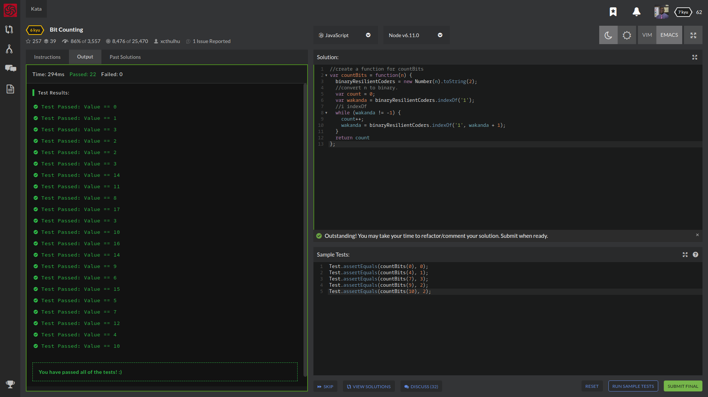

# Kata's For Breakfast, Lunch, and Dinner!
Write a function that takes an (unsigned) integer as input, and returns the number of bits that are equal to one in the binary representation of that number.

Example: The binary representation of 1234 is 10011010010, so the function should return 5 in this case

# ALGORITHMS BITS  BINARY

Test.assertEquals(countBits(0), 0);
Test.assertEquals(countBits(4), 1);
Test.assertEquals(countBits(7), 3);
Test.assertEquals(countBits(9), 2);
Test.assertEquals(countBits(10), 2);

## How It's Made
With this question I knew my first step was to convert n to binary but I never converted a number to a binary so I googled that and I found the Number.prototype.toString() method and found in the example that ..

var x = 6;

console.log(x.toString(2));      

..was close to what I wanted to do but took number as a object, so the syntax for number is new Number(value);

so I made a variable named binaryResilientCoders = to new Number(n).toString(2); I then wanted to use indexOf but I really didn't know the syntax of that method. MDN documentation on String.prototype.indexOf is

var str = 'To be, or not to be, that is the question.';
var count = 0;
var pos = str.indexOf('e');

while (pos !== -1) {
  count++;
  pos = str.indexOf('e', pos + 1);
}

 so I had to create Var count = 0; as well my other variable which I named wakanda = binaryResilientCoders.indexOf('1') while (wakanda !=-1){count ++; wakanda = binaryResilientCoders.indexOf('1', wakanda + 1); and return the count.

## Lessons Learned:
String.prototype.indexOf(), Number.prototype.toString() .

## portfolio:

**WEBSITE:** https:/johnfleurimond.com

## Happy Coding!!!!
